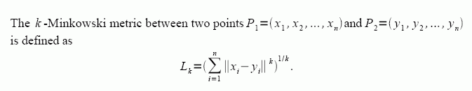
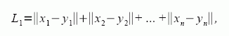
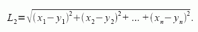
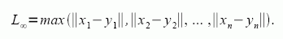

# xyztree

Go package for creating, exporting, importing and nearest-neighbor searching of *3*-d trees.

## Install

To install the package and its demo:
```sh
go get -u github.com/ybeaudoin/go-xyztree
```

## At a glance

The package exports the following:
 * Types:
   * `DataCoords`  
     Array for a data point's float64 R<sup>3</sup> coordinates, i.e., \[1.,2.,3.\]
   * `DataSet`  
     Map for the R<sup>3</sup> data points keyed on string identifiers, i.e., "Pt1":\[1.,2.,3.\], "Pt2":\[4.,5.,6.\], etc.
   * `Node`  
     Structure for a *3*-d tree node
 * Functions:
   * `Export(file string, compact bool)`  
     Exports the *3*-d tree to a specified file using the JSON format with or without newlines and identations.
   * `Import(file string)`  
     Imports a *3*-d tree from a specified JSON file.
   * `Make(refPoints *DataSet, verbose bool)`  
     Creates a *3*-d tree recursively.
   * `NN(refTestPt *DataCoords, metric string, verbose bool) (nnNode Node)`  
     Finds the nearest neighbor of a test point using a specified metric. Returns a best-matching *3*-d tree node.

## *3*-d tree

The *3*-d tree is stored as a slice of structures constituting a top-down binary node list. Each slice element contains a node's
particulars as follows:

| Field | Description |
| --- | --- |
|HYPERPLANE|integer axis index in the range \[0,2\] for the hyperplane: a value of -1 indicates a leaf node.|
|KEY|string for the node point identifier.|
|COORDS|array for the node point coordinates.|
|LEFTCHILD|integer link to the left child node: a value of -1 indicates no child node.|
|RIGHTCHILD|integer link to the right child node: a value of -1 indicates no child node.|

## Metrics

The nearest-neighbor function offers the choice of three distance measures.
All are members of the family of **Minkowski** metrics:


Setting *k* = 1 yields the **Manhattan** metric  


whereas *k* = 2 yields the **Euclidean** metric  


In the limit as *k* tends to infinity, we have the **Max** metric  


The differences between them can be illustrated as follows. Set *&#949;* as the greater-than-zero value of the
*k*-Minkowski metric for all values of *k*. Furthermore, let P be a fixed point in R<sup>3</sup>. Then the loci of
points Q that satisfy *L<sub>k</sub>(P,Q) = &#949;* define various nested geometrical figures. For
*k &#8594; &#8734;*, the figure is a *cube* whereas, for *k* = 2, it's a *sphere* inscribed within the previous cube
and, for *k* = 1, it's an *octahedron* inscribed within the previous sphere. Think of this as a set of <a
href="http://en.wikipedia.org/wiki/Matryoshka_doll" target="_blank">Matryoshka dolls</a> with the loci of the **Manhattan**
metric being the innermost doll and that of the **Max** metric the outermost.

## CAVEAT

So it then follows that, as our a nearest-neighbor search only returns a single best match, the result is not necessarily
unique. Other candidates may well be equally distanced. It's just a matter of which one gets processed first and whether this
meets your needs.

## References

* https://en.wikipedia.org/wiki/K-d_tree
* http://web.stanford.edu/class/cs106l/handouts/assignment-3-kdtree.pdf

## MIT License

Copyright (c) 2016 Yves Beaudoin webpraxis@gmail.com

See the file LICENSE for copying permission.


